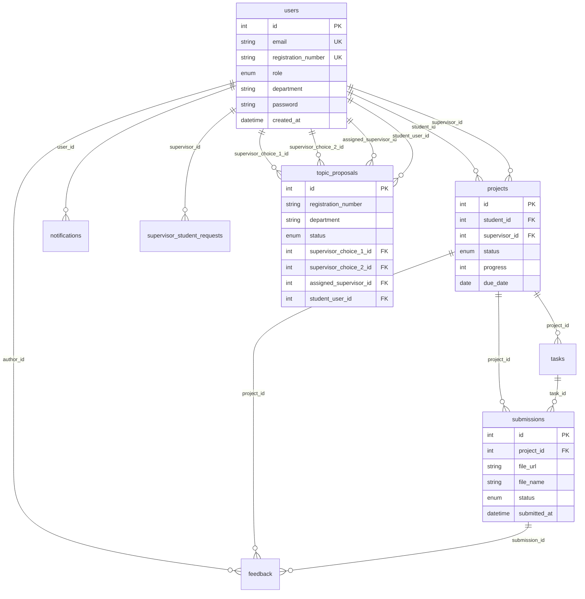

# E-Supervision — Database Reference

PostgreSQL database: **`e_supervision`**  
ORM source of truth: `backend/app/models.py`  
Bootstrap SQL: [`database/schema.sql`](database/schema.sql)  
Setup guide: [`database/README.md`](database/README.md)

---

## Overview

| Item | Detail |
|------|--------|
| **Engine** | PostgreSQL 14+ (local pgAdmin, Neon, Supabase, Render) |
| **Tables** | 8 (`users`, `projects`, `tasks`, `submissions`, `feedback`, `notifications`, `topic_proposals`, `supervisor_student_requests`) |
| **Migrations** | No Alembic — SQLAlchemy `create_all` + patches in `backend/app/migrate.py` |
| **Timestamps** | Stored as **UTC** in the database; displayed as **Africa/Kigali** in the UI |
| **Demo reset** | `cd backend && python reseed_db.py` |
| **Upload files** | `backend/uploads/` (not in DB — only `file_url` path stored) |

### Local vs production

| Environment | Database name | Connection |
|-------------|---------------|------------|
| pgAdmin (local) | `e_supervision` | `PGHOST=localhost`, `PGDATABASE=e_supervision` |
| Neon (production) | `e_supervision` | Render `PG*` env vars — **not** `neondb` |
| Quick dev | SQLite | `DATABASE_URL=sqlite:///./uok.db` (no topic-proposal email) |

---

## Entity-relationship diagram



---

## Tables (8)

### `users`

Central account table for students, supervisors, and HODs.

| Column | Type | Notes |
|--------|------|-------|
| `id` | INTEGER PK | Auto-increment |
| `full_name` | VARCHAR | Required |
| `email` | VARCHAR UNIQUE | Staff login; student contact |
| `password` | VARCHAR | bcrypt hash |
| `role` | ENUM | `STUDENT`, `SUPERVISOR`, `HOD` |
| `department` | VARCHAR | `IT`, `LAW`, `BUSINESS`, `EDUCATION` |
| `title` | VARCHAR | Job title |
| `program` | VARCHAR | Academic programme |
| `phone` | VARCHAR | Contact number |
| `avatar_url` | VARCHAR | Optional profile image |
| `bio` | TEXT | Profile text |
| `active` | BOOLEAN | Default `true` |
| `registration_number` | VARCHAR UNIQUE | 12-digit student login ID |
| `created_at` | TIMESTAMP | Account creation |

---

### `projects`

One capstone project per assigned student.

| Column | Type | Notes |
|--------|------|-------|
| `id` | INTEGER PK | |
| `title` | VARCHAR | Project title |
| `description` | TEXT | Summary |
| `current_phase` | VARCHAR | e.g. Chapter 3 |
| `status` | ENUM | `PROPOSAL` … `COMPLETED`, `ON_HOLD` |
| `progress` | INTEGER | 0–100 |
| `start_date` | DATE | |
| `due_date` | DATE | |
| `student_id` | FK → `users.id` | Project owner |
| `supervisor_id` | FK → `users.id` | Assigned supervisor |

---

### `tasks`

Milestones and work items for a project.

| Column | Type | Notes |
|--------|------|-------|
| `id` | INTEGER PK | |
| `title` | VARCHAR | |
| `description` | TEXT | |
| `category` | VARCHAR | e.g. RESEARCH, DESIGN |
| `status` | ENUM | `UPCOMING`, `IN_PROGRESS`, `COMPLETED`, `OVERDUE` |
| `priority` | ENUM | `LOW`, `MEDIUM`, `HIGH` |
| `progress` | INTEGER | 0–100 |
| `due_date` | DATE | |
| `milestone` | BOOLEAN | Major deliverable flag |
| `project_id` | FK → `projects.id` | |

---

### `submissions`

Student file uploads (PDF/Word) for supervisor review.

| Column | Type | Notes |
|--------|------|-------|
| `id` | INTEGER PK | |
| `title` | VARCHAR | Submission title |
| `notes` | TEXT | Student notes |
| `file_url` | VARCHAR | e.g. `/api/files/{stored_name}` |
| `file_name` | VARCHAR | Original filename |
| `status` | ENUM | `SUBMITTED`, `UNDER_REVIEW`, `APPROVED`, `NEEDS_REVISION` |
| `submitted_at` | TIMESTAMP | Used for **08:00–17:00 window** and **queue priority** |
| `project_id` | FK → `projects.id` | |
| `task_id` | FK → `tasks.id` | Optional linked task |

**Business rules (application layer):**
- Uploads allowed **08:00–17:00** (`Africa/Kigali`) when `SUBMISSION_WINDOW_ENABLED=true`
- Supervisor review queue sorted by **hour of submission** (morning before afternoon)

---

### `feedback`

Supervisor comments on submissions or general project feedback.

| Column | Type | Notes |
|--------|------|-------|
| `id` | INTEGER PK | |
| `title` | VARCHAR | |
| `content` | TEXT | Required |
| `created_at` | TIMESTAMP | |
| `project_id` | FK → `projects.id` | |
| `author_id` | FK → `users.id` | Usually supervisor |
| `submission_id` | FK → `submissions.id` | Optional |

---

### `notifications`

In-app alerts for deadlines, submissions, assignments, and proposals.

| Column | Type | Notes |
|--------|------|-------|
| `id` | INTEGER PK | |
| `title` | VARCHAR | |
| `message` | TEXT | |
| `type` | ENUM | `DEADLINE`, `FEEDBACK`, `ASSIGNMENT`, `SYSTEM`, `APPROVAL` |
| `severity` | ENUM | `LOW`, `MEDIUM`, `HIGH` |
| `read` | BOOLEAN | |
| `action_path` | VARCHAR | Frontend route, e.g. `/supervisor/reviews` |
| `created_at` | TIMESTAMP | |
| `user_id` | FK → `users.id` | Recipient |

---

### `topic_proposals`

Public capstone topic applications **before** a student portal account exists.

| Column | Type | Notes |
|--------|------|-------|
| `id` | INTEGER PK | |
| `full_name` | VARCHAR | Applicant name |
| `email` | VARCHAR | Contact email |
| `registration_number` | VARCHAR | 12-digit reg number |
| `phone` | VARCHAR | Optional |
| `program` | VARCHAR | Selected programme |
| `department` | VARCHAR | Routed to HOD |
| `topic_1` … `topic_3` | VARCHAR | Three proposed titles |
| `abstract_1` … `abstract_3` | TEXT | Three abstracts |
| `supervisor_choice_1_id` | FK → `users.id` | 1st preference |
| `supervisor_choice_2_id` | FK → `users.id` | 2nd preference |
| `status` | ENUM | `PENDING`, `APPROVED`, `REJECTED` |
| `selected_topic_index` | INTEGER | 1–3 when approved |
| `rejection_reason` | TEXT | When rejected |
| `assigned_supervisor_id` | FK → `users.id` | Set on approval |
| `student_user_id` | FK → `users.id` | Portal account created on approval |
| `created_at` | TIMESTAMP | |

**Workflow:** `/apply` form → HOD reviews → approve creates `users` + `projects` → student logs in with reg number.

---

### `supervisor_student_requests`

Supervisors requesting an additional student from their HOD.

| Column | Type | Notes |
|--------|------|-------|
| `id` | INTEGER PK | |
| `supervisor_id` | FK → `users.id` | Requesting supervisor |
| `message` | TEXT | Request justification |
| `status` | ENUM | `PENDING`, `APPROVED`, `REJECTED` |
| `hod_response` | TEXT | HOD reply |
| `created_at` | TIMESTAMP | |

---

## Enum reference

| Enum | Values |
|------|--------|
| Role | `STUDENT`, `SUPERVISOR`, `HOD` |
| ProjectStatus | `PROPOSAL`, `IN_PROGRESS`, `UNDER_REVIEW`, `REVISION`, `COMPLETED`, `ON_HOLD` |
| TaskStatus | `UPCOMING`, `IN_PROGRESS`, `COMPLETED`, `OVERDUE` |
| Priority | `LOW`, `MEDIUM`, `HIGH` |
| SubmissionStatus | `SUBMITTED`, `UNDER_REVIEW`, `APPROVED`, `NEEDS_REVISION` |
| NotificationType | `DEADLINE`, `FEEDBACK`, `ASSIGNMENT`, `SYSTEM`, `APPROVAL` |
| ProposalStatus | `PENDING`, `APPROVED`, `REJECTED` |
| RequestStatus | `PENDING`, `APPROVED`, `REJECTED` |

---

## Foreign keys & relationships

| Child table | Column | Parent | On delete |
|-------------|--------|--------|-----------|
| `projects` | `student_id` | `users.id` | SET NULL |
| `projects` | `supervisor_id` | `users.id` | SET NULL |
| `tasks` | `project_id` | `projects.id` | CASCADE |
| `submissions` | `project_id` | `projects.id` | CASCADE |
| `submissions` | `task_id` | `tasks.id` | SET NULL |
| `feedback` | `project_id` | `projects.id` | CASCADE |
| `feedback` | `author_id` | `users.id` | SET NULL |
| `feedback` | `submission_id` | `submissions.id` | SET NULL |
| `notifications` | `user_id` | `users.id` | CASCADE |
| `topic_proposals` | `supervisor_choice_1_id` | `users.id` | SET NULL |
| `topic_proposals` | `supervisor_choice_2_id` | `users.id` | SET NULL |
| `topic_proposals` | `assigned_supervisor_id` | `users.id` | SET NULL |
| `topic_proposals` | `student_user_id` | `users.id` | SET NULL |
| `supervisor_student_requests` | `supervisor_id` | `users.id` | CASCADE |

### Cardinality

- One **student** → at most one active **project** (demo assumes one capstone project per student).
- One **project** → many **tasks**, **submissions**, **feedback** rows.
- One **supervisor** → many **projects** (capacity default: 8 students).
- One **topic proposal** → creates one **user** + one **project** when HOD assigns & approves.

---

## Indexes

| Table | Index | Purpose |
|-------|-------|---------|
| `users` | `email` (unique) | Staff login lookup |
| `users` | `registration_number` (unique) | Student login lookup |
| `topic_proposals` | `registration_number` | Duplicate proposal check |
| `topic_proposals` | `department` | HOD department filter |

---

## Time & timezone

All `created_at` / `submitted_at` columns use **UTC** at rest.

| Layer | Behaviour |
|-------|-----------|
| Backend writes | `utc_now()` in `backend/app/datetime_utils.py` |
| API JSON | ISO timestamps (frontend treats naive values as UTC) |
| Frontend display | `Africa/Kigali` via `frontend/src/lib/format.ts` |
| Submission window | 08:00–17:00 Kigali (`SUBMISSION_WINDOW_*` env vars) |
| Review SLA | 168 hours (7 days) from `submitted_at` |
| Queue priority | Earlier **Kigali hour** = higher priority on supervisor dashboard |

---

## Data flows

### A. Public topic proposal (`/apply`)

```
topic_proposals (PENDING)
  → HOD reviews at /hod/proposals
  → POST /api/hod/topic-proposals/{id}/approve
  → INSERT users (STUDENT) + INSERT projects
  → topic_proposals.status = APPROVED
```

### B. HOD assigns existing student

```
users (STUDENT, no supervisor)
  → POST /api/hod/students/{id}/assign-supervisor
  → INSERT or UPDATE projects.supervisor_id
  → notifications to student + supervisor
```

### C. Student submission

```
POST /api/student/submissions (multipart file)
  → INSERT submissions (file_url → backend/uploads/)
  → notification to supervisor
  → supervisor opens file via GET /api/files/{name} (auth + ownership check)
```

### D. Supervisor review

```
POST /api/supervisor/submissions/{id}/review
  → UPDATE submissions.status
  → INSERT feedback (optional)
  → notification + email to student
```

---

## API ↔ table map

| Endpoint | Tables touched |
|----------|----------------|
| `POST /api/auth/login` | `users` (read) |
| `POST /api/public/topic-proposals` | `topic_proposals`, `notifications` |
| `GET /api/hod/students` | `users`, `projects` |
| `POST /api/hod/students/{id}/assign-supervisor` | `projects`, `notifications` |
| `POST /api/hod/topic-proposals/{id}/approve` | `topic_proposals`, `users`, `projects`, `notifications` |
| `POST /api/student/submissions` | `submissions`, `notifications` |
| `GET /api/supervisor/reviews` | `submissions`, `projects`, `users` |
| `POST /api/supervisor/submissions/{id}/review` | `submissions`, `feedback`, `notifications` |

---

## Demo data summary

After `python reseed_db.py`:

| Role | Example login | Password |
|------|---------------|----------|
| Student | `202305000078` | `202305000078` |
| Supervisor | `jean.bosco@uok.ac.rw` | `Password@123` |
| HOD (IT) | `hod.it@uok.ac.rw` | `Password@123` |

| Department | HOD email | Sample supervisor |
|------------|-----------|-------------------|
| IT | `hod.it@uok.ac.rw` | `jean.bosco@uok.ac.rw` |
| Law | `hod.law@uok.ac.rw` | `law.kamanzi@uok.ac.rw` |
| Business | `hod.business@uok.ac.rw` | `finance.uwase@uok.ac.rw` |
| Education | `hod.education@uok.ac.rw` | `education.niyonsenga@uok.ac.rw` |

**Unassigned students (HOD assign testing):** `202205000210` (Aline Uwimana), `202205000215` (Kevin Mugisha).

**Pending topic proposals:** 3 (IT, Law, Business) + 1 rejected sample.

**Demo files:** PDFs in `backend/uploads/` linked from seeded `submissions.file_url`.

See [README.md](README.md) for the full account list.

---

## Reseed demo data

```bash
cd backend
source .venv/bin/activate   # or your virtualenv
python reseed_db.py
```

Demo includes:
- 4 HODs, 10 supervisors, ~15 students across 4 departments
- 2 **unassigned** IT students (`202205000210`, `202205000215`) for HOD assign testing
- Submissions with **demo PDF files** in `backend/uploads/`
- Same-day submissions at **08:00** and **17:00** to demonstrate supervisor queue priority

See [README.md](README.md) for login credentials.
